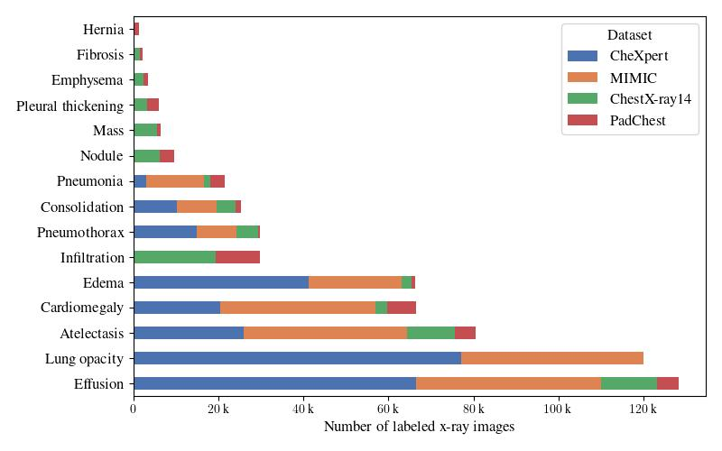

# MetaChest

MetaChest is publicly available dataset of chest radiographs and patologies generated from ChestX-ray14, CheXpert, MIMIC-CXR-JPG and PadChest datasets.



## Datasets Setup

1. Download and extract the datasets following the instructions on their websites. We strongly recommend the use of one directory per dataset. The following files are needed.

    * [ChestX-ray14](https://nihcc.app.box.com/v/ChestXray-NIHCC/folder/36938765345). Download `Data_Entry_2017_v2020.csv` and `batch_download_zips.py`, then run:
        ```bash
        cd {chexpert_dir}
        python batch_download_zips.py
        ```
        Extract all `images_*.tar.gz` files.

    * [CheXpert](https://stanfordmlgroup.github.io/competitions/chexpert/). The complete dataset, we recommend using `azcopy`.
        ```bash
        azcopy cp {provided_url} {chexpert_dir} --recursive
        ```

    * [MIMIC](https://physionet.org/content/mimic-cxr-jpg/2.0.0/). The complete dataset.

    * [PadChest](https://bimcv.cipf.es/bimcv-projects/padchest/). The complete dataset, we recommend using `rclone`.
        ```bash
        rclone -vP copy {provided_url} {padchest_dir}
        ```

    * MetaChest. Create an directory where all files will be stored.

2. Specify the dataset directories in the `config.toml` file.

3. Create and activate the enviroment.
    ```bash
    conda env create -f env.yml
    conda activate metachest
    ```

4. Generate the final `metachest.csv` dataset file:
    ```bash
    snakemake -c1
    ```


## Resizing images

To resize images from all datasets:

    ```bash
    snakemake -R images -c1
    ```

The images will be stored on the `metachest_dir` directory.
