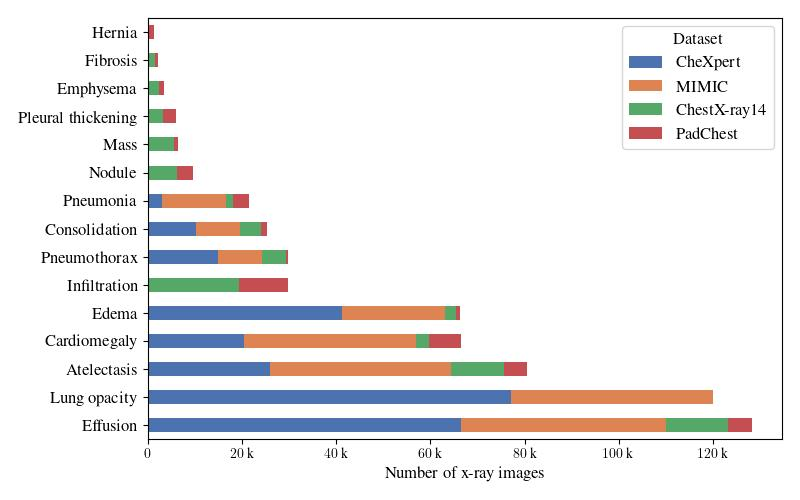
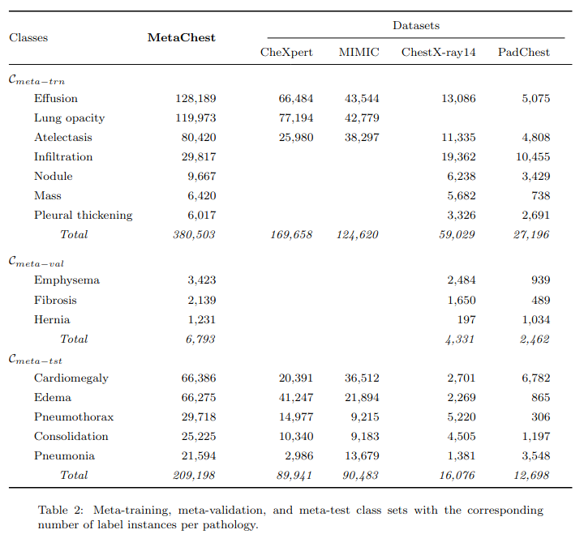

---
hide:
  - navigation
---

#



## Overview

[Metachest](https://github.com/bereml/metachest) is publicly available dataset patology classification on chest radiographs generated from ChestX-ray14, CheXpert, MIMIC-CXR-JPG and PadChest datasets.



A detailed explanation of the collection procedure and statistics can be found in the paper [MetaChest: Generalized few-shot learning of patologies from chest X-rays]().


## Data

The code to generate the dataset is available at its [repository](https://github.com/bereml/metachest).


## License
[Creative Commons Attribution Non Commercial Share Alike 4.0 International CC BY-NC-SA](https://creativecommons.org/licenses/by-nc-sa/4.0/legalcode).


<!-- ## Citing
If you find this work useful in your research, please consider citing.

```
@article{Trailers12k-2023103343,
title = {Improving Transfer Learning for Movie Trailer Genre Classification using a Dual Image and Video Transformer},
journal = {Information Processing & Management},
volume = {60},
number = {3},
pages = {103343},
year = {2023},
issn = {0306-4573},
doi = {https://doi.org/10.1016/j.ipm.2023.103343},
url = {https://www.sciencedirect.com/science/article/pii/S0306457323000808},
author = {Ricardo Montalvo-Lezama and Berenice Montalvo-Lezama and Gibran Fuentes-Pineda},
keywords = {Multi-label classification, Transfer learning, Trailers12k, Spatio-temporal analysis, Video analysis, Transformer model},
}
``` -->


## People

Please feel free to contact us if you have questions.

* [Berenice Montalvo Lezama](https://turing.iimas.unam.mx/~bereml/)
* [Gibran Fuentes Pineda](https://turing.iimas.unam.mx/~gibranfp/)
